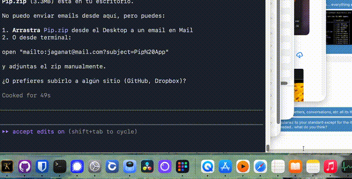

# Pip

A smart app launcher for macOS that learns what you use most.



Pip lives in your Dock. Click it and a 3×3 grid appears with your 9 most-used apps. Click an app — it launches, Pip hides. That's it.

## How it works

- **Monitors your usage** in the background — tracks which apps you spend time in
- **Sorts by real usage** — the apps you use most rise to the top
- **Adapts over time** — install new apps, use them, they'll appear in the grid
- **Zero config** — no setup, no preferences, no accounts

## Install

1. Unzip `Pip.zip`
2. Move `Pip.app` to `/Applications/`
3. Open Terminal and run:

```bash
# Remove Gatekeeper quarantine
xattr -r -d com.apple.quarantine /Applications/Pip.app

# Copy support files
mkdir -p ~/.local/share/board
cp -R /Applications/Pip.app/Contents/Resources/board/* ~/.local/share/board/

# Install the server (serves the grid UI)
cat > ~/Library/LaunchAgents/com.board.server.plist << 'EOF'
<?xml version="1.0" encoding="UTF-8"?>
<!DOCTYPE plist PUBLIC "-//Apple//DTD PLIST 1.0//EN" "http://www.apple.com/DTDs/PropertyList-1.0.dtd">
<plist version="1.0">
<dict>
    <key>Label</key>
    <string>com.board.server</string>
    <key>ProgramArguments</key>
    <array>
        <string>/usr/bin/python3</string>
        <string>~/.local/share/board/server.py</string>
    </array>
    <key>RunAtLoad</key>
    <true/>
    <key>KeepAlive</key>
    <true/>
</dict>
</plist>
EOF

# Install the usage monitor (tracks active apps)
cat > ~/Library/LaunchAgents/com.pip.monitor.plist << 'EOF'
<?xml version="1.0" encoding="UTF-8"?>
<!DOCTYPE plist PUBLIC "-//Apple//DTD PLIST 1.0//EN" "http://www.apple.com/DTDs/PropertyList-1.0.dtd">
<plist version="1.0">
<dict>
    <key>Label</key>
    <string>com.pip.monitor</string>
    <key>ProgramArguments</key>
    <array>
        <string>/usr/bin/python3</string>
        <string>~/.local/share/board/monitor.py</string>
    </array>
    <key>RunAtLoad</key>
    <true/>
    <key>KeepAlive</key>
    <true/>
</dict>
</plist>
EOF

# Start the services
launchctl load ~/Library/LaunchAgents/com.board.server.plist
launchctl load ~/Library/LaunchAgents/com.pip.monitor.plist
```

4. Open `Pip` from Applications
5. Drag it to the Dock to keep it there

## Usage

| Action | What happens |
|--------|-------------|
| Click Pip in Dock | Grid appears above the icon |
| Click an app in the grid | App launches, grid hides |
| Click Pip again | Grid reappears |
| Ctrl + Space | Toggle grid from anywhere |

## How the grid is ordered

The app you use most sits at the **bottom center** of the grid — directly above the Pip icon in the Dock. The rest fill outward by usage.

```
 ┌───┬───┬───┐
 │ 6 │ 5 │ 7 │  ← least used
 ├───┼───┼───┤
 │ 3 │ 2 │ 4 │  ← medium
 ├───┼───┼───┤
 │ 8 │ 1 │ 9 │  ← most used (1 = your #1 app)
 └───┴───┴───┘
       ↑
    Pip icon
```

## What gets tracked

Pip tracks:
- **Foreground time** — how many seconds each app is active
- **Launch count** — how many times you open an app from Pip
- **Last used** — when you last used each app

All data is stored locally in `~/.local/share/board/usage.json`. Nothing is sent anywhere.

## Uninstall

```bash
# Stop services
launchctl unload ~/Library/LaunchAgents/com.board.server.plist
launchctl unload ~/Library/LaunchAgents/com.pip.monitor.plist
rm ~/Library/LaunchAgents/com.board.server.plist
rm ~/Library/LaunchAgents/com.pip.monitor.plist

# Remove files
rm -rf ~/.local/share/board
rm -rf /Applications/Pip.app
```

## Requirements

- macOS 14 (Sonoma) or later
- Apple Silicon or Intel

## Built with

- Swift (native macOS panel + WebKit)
- Python 3 (local server + usage monitor)
- HTML/CSS/JS (grid UI)

---

Made by jaganat
